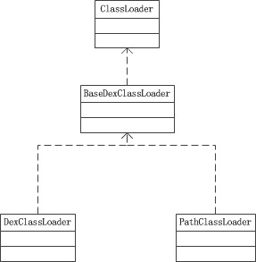
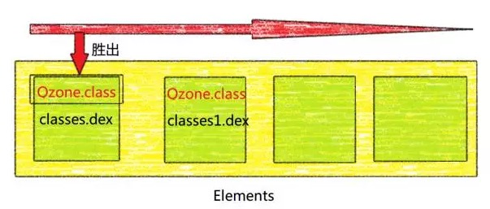
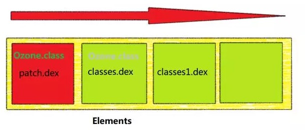

@[TOC](Android热修复原理,以及手写)


## 我们先来看下Activity是如何创建的

　　在`ActivityThread`中调用了`handleLaunchActivity`方法接着调用了`performLaunchActivity`方法,以下是创建Activity的代码:

```
        Activity activity = null;
        try {
            java.lang.ClassLoader cl = appContext.getClassLoader();
            activity = mInstrumentation.newActivity(
                    cl, component.getClassName(), r.intent);
            StrictMode.incrementExpectedActivityCount(activity.getClass());
            r.intent.setExtrasClassLoader(cl);
            r.intent.prepareToEnterProcess();
            if (r.state != null) {
                r.state.setClassLoader(cl);
            }
        } catch (Exception e) {
            if (!mInstrumentation.onException(activity, e)) {
                throw new RuntimeException(
                    "Unable to instantiate activity " + component
                    + ": " + e.toString(), e);
            }
        }
        
        
        //最终会调用到:
        
        (Activity) cl.loadClass(className).newInstance();
        
        //cl 代表的Classloader代表PathClassLoader
        return new PathClassLoader(classPath, librarySearchPath, BootClassLoader.getInstance());
```

## ClassLoader体系

以下是DVM的ClassLoader体系



1. Android系统是通过PathClassLoader加载系统类和已安装的应用的。
2. 而DexClassLoader则可以从一个jar包或者未安装的apk中加载dex,所以动态加载dex的时候我们应该使用DexClassLoader

## ClassLoader源码分析

`ClassLoader`到底是如何在dex中查找到类的呢? `DexClassLoader`和`PathClassLoader`都只重写了BaseDexClassLoader的构造而已，而具体的加载逻辑则在`BaseDexClassLoader`中。

这部分源码都很简单，请务必看懂

**BaseDexClassLoader部分源码：**

```
public class BaseDexClassLoader extends ClassLoader {
    private final DexPathList pathList;

    /**
     * Constructs an instance.
     *
     * @param dexPath the list of jar/apk files containing classes and
     * resources, delimited by {@code File.pathSeparator}, which
     * defaults to {@code ":"} on Android
     * @param optimizedDirectory directory where optimized dex files
     * should be written; may be {@code null}
     * @param libraryPath the list of directories containing native
     * libraries, delimited by {@code File.pathSeparator}; may be
     * {@code null}
     * @param parent the parent class loader
     */
    public BaseDexClassLoader(String dexPath, File optimizedDirectory,
            String libraryPath, ClassLoader parent) {
        super(parent);
        this.pathList = new DexPathList(this, dexPath, libraryPath, optimizedDirectory);
    }

    @Override
    protected Class<?> findClass(String name) throws ClassNotFoundException {
        List<Throwable> suppressedExceptions = new ArrayList<Throwable>();
        Class c = pathList.findClass(name, suppressedExceptions);
        if (c == null) {
            ClassNotFoundException cnfe = new ClassNotFoundException("Didn't find class \"" + name + "\" on path: " + pathList);
            for (Throwable t : suppressedExceptions) {
                cnfe.addSuppressed(t);
            }
            throw cnfe;
        }
        return c;
    }
}
```

从源码得知，当我们需要加载一个class时，实际是从pathList中去找的，而pathList则是DexPathList的一个实体。

**DexPathList部分源码：**

```
/*package*/ final class DexPathList {
    ...
    /**
     * List of dex/resource (class path) elements.
     * Should be called pathElements, but the Facebook app uses reflection
     * to modify 'dexElements' (http://b/7726934).
     */
    private final Element[] dexElements;

    /**
     * Finds the named class in one of the dex files pointed at by
     * this instance. This will find the one in the earliest listed
     * path element. If the class is found but has not yet been
     * defined, then this method will define it in the defining
     * context that this instance was constructed with.
     *
     * @param name of class to find
     * @param suppressed exceptions encountered whilst finding the class
     * @return the named class or {@code null} if the class is not
     * found in any of the dex files
     */
    public Class findClass(String name, List<Throwable> suppressed) {
        for (Element element : dexElements) {
            DexFile dex = element.dexFile;

            if (dex != null) {
                Class clazz = dex.loadClassBinaryName(name, definingContext, suppressed);
                if (clazz != null) {
                    return clazz;
                }
            }
        }
        if (dexElementsSuppressedExceptions != null) {
            suppressed.addAll(Arrays.asList(dexElementsSuppressedExceptions));
        }
        return null;
    }
}
```

从这段源码可以看出，`dexElements`是用来保存dex的数组，而每个`dex`文件其实就是`DexFile`对象。遍历`dexElements`，然后通过DexFile去加载class文件，加载成功就返回，否则返回null

以下是classloader加载类的流程:


## 热补丁修复技术的原理

上面的源码，我们注意到一点，如果两个dex中存在相同的class文件会怎样？  
先从第一个dex中找，找到了直接返回，遍历结束。而第二个dex中的class永远不会被加载进来。  
简而言之，两个dex中存在相同class的情况下，dex1的class会覆盖dex2的class。  
盗一下QQ空间的图，如图：classes1.dex中的Qzone.class并不会被加载



而热补丁技术则利用了这一特性，当一个app出现bug的时候，我们就可以将出现那个bug的类修复后，重新编译打包成dex，
插入到dexElements的前面，那么出现bug的类就会被覆盖，app正常运行，这就是热修复的原理了。




## 自己动手写的热修复注意点:

1. 在不混淆的情况下可以把出错的class 重新打成一个fix.dex!! 如果混淆的话还是直接打成apk,然后解压apk拿到其中的class.dex再去修复
2. 分包 把不会出错的分成一个dex (尽量不要混淆) , 其他的留在另一个dex ,
方法没有超过65536 那么 Android Studio 需要去官网找分包。而且运行的时候如果从dex过大会影响启动速度
3. 直接下载整个dex包，然后进行插入修复，问题就是fix.dex可能比较大 2M


 


      
     
 

